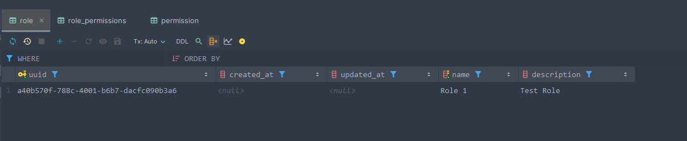
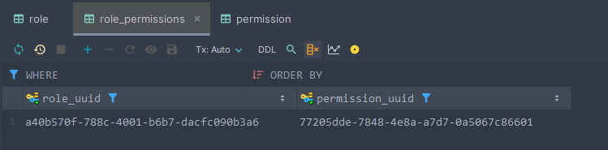
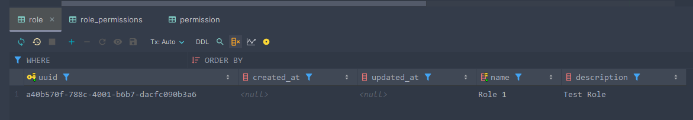

## Description

NestJS test Project

## Project setup

```bash
$ npm install
```

## Compile and run the project

```bash
# development
$ npm run dev
```

## Reproduction

To reproduce this error a Postgres database is needed. It needs a user, in this case *test1* with password *12344* and its corresponding schema *test1* which is the default schema, as well as a second schema *test2*.

The database can be created with the following command:

```bash
docker compose up -d
```

If use use the command you need to add a second schema called *test2* and you need to start the project once to autogenerate the tables.

After that you need to add a entry to the table Role in the schema *test2*, add a entry to the table Permission in *test1* and the corresponding relation to the table role_permissions in *test2*.

Now you can start the project with the command mentioned above.

The last step is to send a request to thee endpoint *http://localhost:3000/testapp/{uuid}*, where the uuid is the uuid of the role in the table Role in the schema *test2*.

The expected output is the role with the corresponding permissions. But the output is a Role with an empty permissions array.

As example this is what the output should look like:
```json
{
  "uuid": "a40b570f-788c-4001-b6b7-dacfc090b3a6",
  "name": "Role 1",
  "description": "Test Role",
  "permissions": [
    {
      "uuid": "77205dde-7848-4e8a-a7d7-0a5067c86601",
      "name": "Perm 1"
    }
  ]
}
```

But the actual output is this:
```json
{
  "uuid": "a40b570f-788c-4001-b6b7-dacfc090b3a6",
  "name": "Role 1",
  "description": "Test Role",
  "permissions": []
}
```

## Examples

Here are some example entries in the database

### Schema: test1



### Schema: test2


